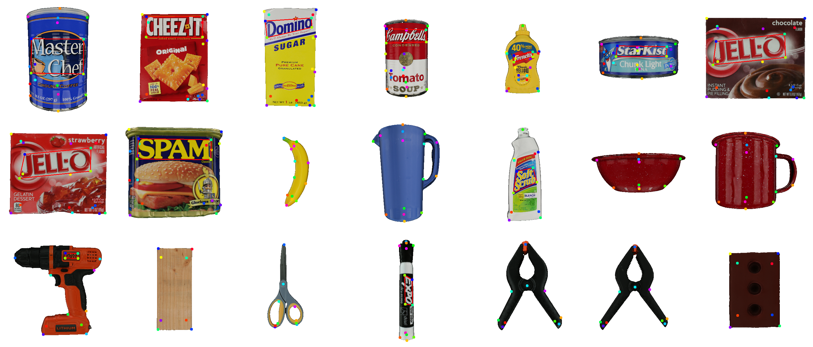
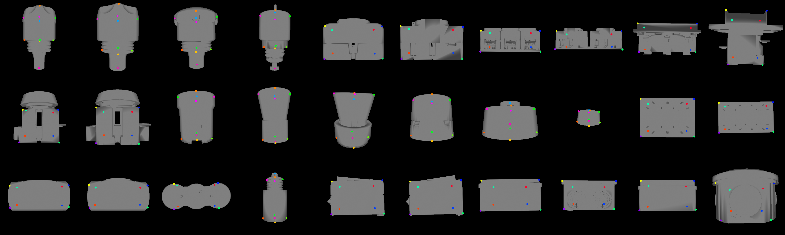
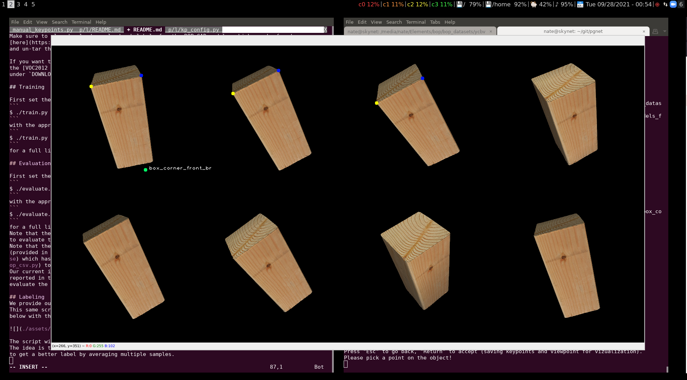
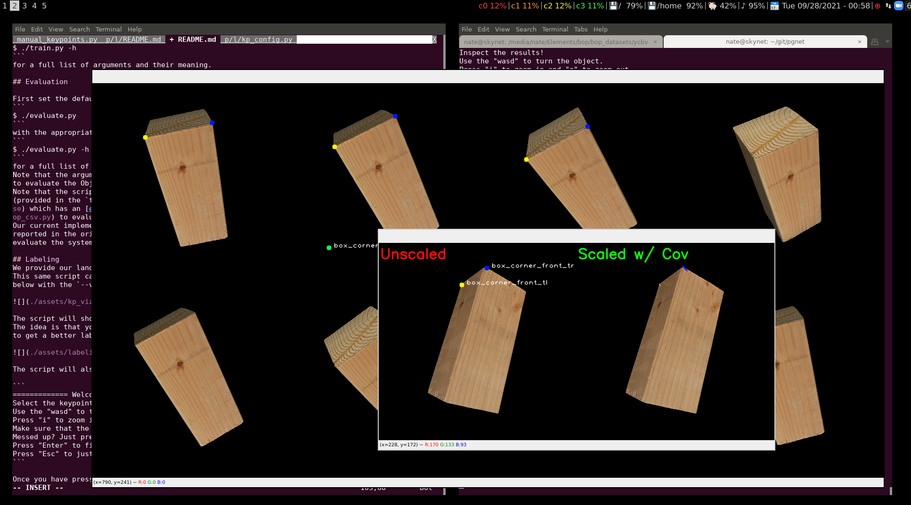

# SUO-SLAM

This repository will host the code for our CVPR 2022 paper
"Symmetry and Uncertainty-Aware Object SLAM for 6DoF Object Pose Estimation".
The code is coming soon.
For now, we provide the links to download the datasets as well as our keypoint labels
and labeling tool.

## Citation
If you use any part of this repository in an academic work, please cite our paper as:

```
@inproceedings{Merrill2022CVPR,
  Title      = {Symmetry and Uncertainty-Aware Object SLAM for 6DoF Object Pose Estimation},
  Author     = {Nathaniel Merrill and Yuliang Guo and Xingxing Zuo and Xinyu Huang and Stefan Leutenegger and Xi Peng and Liu Ren and Guoquan Huang},
  Booktitle  = {2022 Conference on Computer Vision and Pattern Recognition (CVPR)},
  Year       = {2022},
  Address    = {New Orleans, USA},
  Month      = jun,
}
```

## Installation

This codebase was tested on Ubuntu 18.04.
To use the BOP rendering (i.e. for keypoint labeling) install
```
sudo apt install libfreetype6-dev libglfw3
```

You will also need a python environment that contains the required packages. To 
see what packages we used, check out the list of requirements in `requirements.txt`.
They can be installed via `pip install -r requirements.txt`

## Preparing Data

### Datasets
To be able to run the training and testing (code coming soon), first decide on a place to download the data to.
Call this directory `DOWNLOAD_DIR`, and the rest of the instructions will assume that this is
set as an environment variable.
The disk will need a few hundred GB of space for all the data (at least 150GB for download and more
to extract).
You can pick and choose what data you want to download (for example just T-LESS or YCBV).
Note that all YCBV and TLESS downloads have our keypoint labels packaged along with the data.
Download the following google drive links into `$DOWNLOAD_DIR` and extract them.
- [YCBV full dataset](https://drive.google.com/file/d/1C-CkqYiCC-PqySL70QX7k_YQzGccX6dG/view?usp=sharing)
- [YCBV eval-only dataset](https://drive.google.com/file/d/17aLUdsfNZ98xinCf1YJzciVE4xwUcgnz/view?usp=sharing)
- [T-LESS dataset](https://drive.google.com/file/d/1h15UYWiLYmwTJi-hh0t5EFA77H1ElSLa/view?usp=sharing)
- [Saved detections (eval only)](https://drive.google.com/file/d/1WjEUgQDs34U63vlPXkd7SOVco58Jvn6F/view?usp=sharing)
- [VOC dataset (training only)](https://drive.google.com/file/d/1QNCRac2MxbJALEHmpKW1D6Pz0oCeDTAy/view?usp=sharing)

When all is said and done, the tree should look like this (output is simplified here)
```
$ cd $DOWNLOAD_DIR && tree --filelimit 3
.
├── bop_datasets
│   ├── tless 
│   └── ycbv 
├── saved_detections
└── VOCdevkit
    └── VOC2012
```

## Labeling
### Overview
We manually label keypoints on the CAD model to enable some keypoints with semantic meaning.
For the full list of keypoint meanings, see the specific [README](./lib/labeling/README.md)

We provide our landmark labeling tool. Check out the script `manual_keypoints.py`.
This same script can be used to make a visualization of the keypoints as shown 
below with the `--viz` option.




The script will show a panel of the same object but oriented slightly differently.
The idea is that you pick the same keypoint multiple times to ensure correctness and
to get a better label by averaging multiple samples.



The script will also print the following directions to follow in the terminal.

```
============= Welcome ===============
Select the keypoints with a left click!
Use the "wasd" to turn the objects.
Press "i" to zoom in and "o" to zoom out.
Make sure that the keypoint colors match between all views.
Messed up? Just press 'u' to undo.
Press "Enter" to finish and save the keypoints
Press "Esc" to just quit
```

Once you have pressed "enter", you will get to an inspection pane. 



Where the unscaled mean keypoints are on the left, and the ones scaled by covariance
is on the left, where the ellipses are the Gaussian 3-sigma projected onto the image.
If the covariance is too large, or the mean is out of place, then you may have messed up.
Again, the program will print out these directions to terminal:

```
Inspect the results!
Use the "wasd" to turn the object.
Press "i" to zoom in and "o" to zoom out.
Press "Esc" to go back, "Enter" to accept (saving keypoints and viewpoint for vizualization).
Please pick a point on the object!
```

So if you are done, and the result looks good, then press "Enter", if not then "Esc" to go back.
Make sure also that when you are done, you rotate and scale the object into the best "view pose"
(with the front facing the camera, and top facing up),
as this pose is used by both the above vizualization and the actual training code for determining
the best symmetry to pick for an initial detection.

### Labeling Tips

Even though there are 8 panels, you don't need to fill out all 8. Each keypoint just
needs at least 3 samples to sample the covariance.

We recommend that you label the same keypoint (say keypoint `i`) on all the object 
renderings first, then go to the inspection panel at the end 
of this each time so that you can easily undo a mistake for keypoint `i` with the "u" key
and not lose any work. Otherwise, if you label each object rendering completely, then
you may have to undo a lot of labelings that were not mistakes.

Also, if there is an object that you want to label a void in the CAD model, like the 
top center of the bowl, then you can use the multiple samples to your advantage, and choose
samples that will average to the desired result, since the labels are required to land on the 
actual CAD model in the labeling tool.

